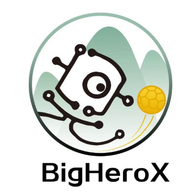
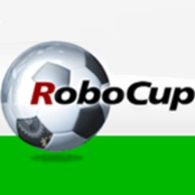
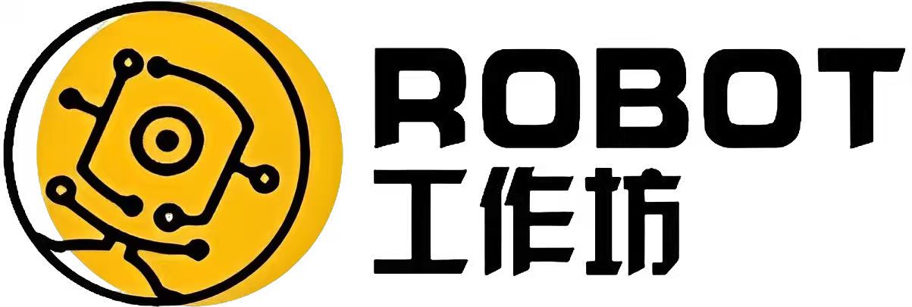

<div align="center">

# BigHeroX | Super Nenglu Team

### Hunan University Robot Workshop · RoboCup Middle Size League



**[中文](./README.md)** | **[English](./README_EN.md)**

---

### 🏆 Hall of Fame

<table>
<tr>
<td align="center">🥇</td>
<td align="center">🥇</td>
<td align="center">🥈</td>
<td align="center">🥈</td>
</tr>
<tr>
<td align="center"><b>2024 China Open<br/>Champion</b></td>
<td align="center"><b>2024 RoboCup<br/>Ambition Challenge Champion</b></td>
<td align="center"><b>2024 RoboCup MSL<br/>Runner-up</b></td>
<td align="center"><b>2023 China Open<br/>Runner-up</b></td>
</tr>
</table>

</div>

---

## 💡 About Us

<table>
<tr>
<td width="60%">

### Who We Are

**BigHeroX (Super Nenglu Team)** is a student robotics team focused on **RoboCup Middle Size League** competitions, affiliated with Hunan University Robot Workshop.

Our goal is simple and annoying to execute:
- Build reliable robots
- Design robust systems
- Win real matches

The name *BigHeroX* comes from *Big Hero 6*.  
Not for nostalgia. For clarity.

</td>
<td width="40%">



</td>
</tr>
</table>

---

## 🎯 What the Name Means

<div align="center">

| Symbol | Meaning |
|:---:|:---|
| **BigHero** | Team-based intelligence over individual brilliance<br/>Every robot matters |
| **X** | The unknown. The variable<br/>The part of the system you didn't model |
| **A Variable Team** | As a rising team, we aim to be<br/>the unpredictable factor on the field |

</div>

---

## 🔧 What We Do

<table>
<tr>
<td width="50%">

### Technical Domains

🤖 **Robot Hardware**
- Mechanical design
- Electronics systems
- Sensor integration

🧠 **Intelligent Decision-Making**
- Perception & localization
- Strategy planning
- Multi-robot coordination

⚙️ **Software Engineering**
- ROS2 architecture
- C++ system development
- Modular & reproducible design

🏆 **Competitions**
- RoboCup China
- Middle Size League

</td>
<td width="50%">



</td>
</tr>
</table>

---

## 🎖️ Our Philosophy

<div align="center">

```
No demo-only projects
No "works once" systems
```

### We Build

**Maintainable · Extensible · Reproducible Robotics Systems**

</div>
